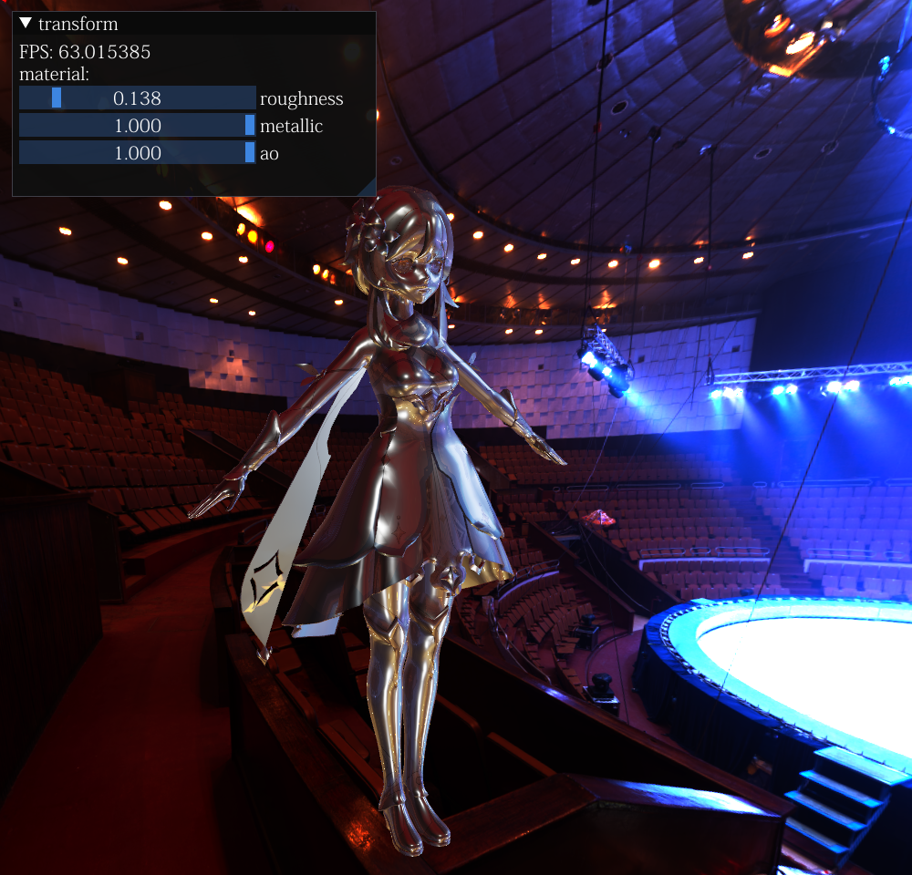

# myRaster
 光栅渲染器
## introduction
基于OpenGL图形API封装的渲染器, 目前实现功能如下:
- 支持FBX格式的模型导入解析
- 基于前向渲染的IBL图像光照和cook-toorance微表面模型
- 支持点光源光照渲染
- 实现延迟渲染的部分功能, 生成G-buffer, 简单的光照
- Imgui的交互界面, 调节整体的材质参数
- 环境背景的渲染

未来实现的功能:
- 光照模型加入延迟渲染中
- 加入sceneGraph, 并添加cpu端的视锥体剔除
- 加入shadowmap阴影效果
- 加入后处理效果

## 当前效果

